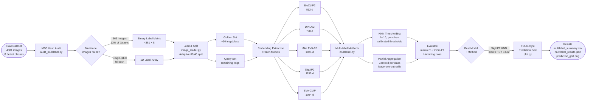

# Adaviv — Harvest Quality Embedding Pipeline
## Phase 1 & 2 Technical Report

**Project:** Harvest Quality Pseudo-Labelling Pipeline  
**Sprint:** HQ Pipeline Sprint Plan v2  
**Author:** Saumith Devarasetty  
**Date:** June 2026  
**Status:** Phase 1 & 2 Complete — Multi-label classification baseline established

---

## Overview

This report documents the research, implementation, and results of the first two phases of the Adaviv Harvest Quality pipeline. The goal was to identify the best embedding model for zero-shot strawberry defect classification, establish a centroid-matching baseline for single-label classification, and extend it to multi-label classification using KNN thresholding.

No model fine-tuning was performed in these phases. All models were used in frozen, zero-shot mode.

---

## Dataset

| Property | Value |
|---|---|
| Crop | Strawberry |
| Total unique images | 4,381 |
| Number of defect classes | 8 |
| Multi-label images | 566 (13% of dataset) |
| Single-label images | 3,815 |
| Two-label images | 553 |
| Three-label images | 13 |
| Random seed | 42 (fixed across all runs) |

### Class Definitions

| ID | Name | Images |
|---|---|---|
| 0 | Healthy | 163 |
| 01 | Hongo podrido (Fungal rot) | 454 |
| 02 | Magullado (Bruised) | 2,249 |
| 03 | Sobre maduro (Overripe) | 55 |
| 04 | Inmadura albina (Unripe/Albino) | 1,018 |
| 05 | Cenicilla bronceada (Powdery mildew) | 30 |
| 06 | Presencia y daño de insecto (Insect damage) | 33 |
| 07 | Deforme (Deformed) | 1,028 |

### Most Common Multi-Label Combinations

| Combination | Count |
|---|---|
| 04 Inmadura albina + 07 Deforme | 308 |
| 01 Hongo podrido + 04 Inmadura albina | 82 |
| 02 Magullado + 07 Deforme | 74 |
| 03 Sobre maduro + 07 Deforme | 16 |
| 01 Hongo podrido + 07 Deforme | 15 |

---

## Phase 1 — Model Research & Selection

### Candidate Models

Five models were selected based on domain relevance (agriculture, biology, plant species), embedding quality, and availability on HuggingFace.

| Model | Source | Embedding Dim | Domain |
|---|---|---|---|
| BioCLIP2 | imageomics/bioclip-2 | 768 | Biology / organisms |
| DINOv2-Large | facebook/dinov2-large | 1024 | General vision |
| SigLIP2 | google/siglip2-so400m-patch14-384 | 1152 | Vision-language |
| iNat EVA-02 | timm/eva02_large_patch14_clip_336.merged2b_ft_inat21 | 1024 | iNaturalist 21 (10K species) |
| PlantCLEF | gerald29/plantclef2024 | 768 | Plant species recognition |

### Why These Models

- **BioCLIP2** — Trained on biological organism images. Closest domain match for fruit defects.
- **DINOv2-Large** — State-of-the-art self-supervised vision encoder. Strong general-purpose embeddings.
- **SigLIP2** — Improved CLIP with sigmoid loss. Strong image-text alignment, useful for zero-shot.
- **iNat EVA-02** — Fine-tuned on 10,000 real-world plant/organism species from citizen science photos. Closest to harvest environment.
- **PlantCLEF** — DINOv2-base fine-tuned on PlantCLEF 2024 plant species recognition competition data.

---

## Phase 2 — Pipeline Implementation

### Architecture

The pipeline was built as a modular system where every model implements the same interface:

```
BaseEmbeddingModel (abstract)
├── load_model()
└── get_embeddings(images) → np.ndarray

Models:
├── BioCLIPModel       (open_clip)
├── DINOv2Model        (transformers AutoModel)
├── SigLIPModel        (transformers AutoModel)
├── iNatEVA02Model     (timm)
└── PlantCLEFModel     (transformers Dinov2Model)
```

### Key Files

| File | Role |
|---|---|
| `run_comparison.py` | Single-label pipeline entry point |
| `run_multilabel.py` | Multi-label pipeline entry point |
| `models/base.py` | Abstract base class |
| `models/__init__.py` | Model registry |
| `data/image_loader.py` | Dataset loader with adaptive golden split |
| `data/audit_multilabel.py` | MD5 hash audit for multi-label detection |
| `embeddings/extractor.py` | Batched embedding extraction with tqdm |
| `evaluation/centroid.py` | Single-label centroid matching |
| `evaluation/multilabel.py` | Multi-label KNN + Partial Aggregation |
| `visualization/plot.py` | UMAP · heatmap · accuracy charts · prediction grid |

### Hardware & Configuration

| Property | Value |
|---|---|
| Device | Apple MPS (MacBook Air M2) |
| Batch size | 32 |
| Golden set size | 30 images per class (adaptive for small classes) |
| Random seed | 42 |

### Adaptive Golden Set Split

Some classes have very few images (05: 30, 06: 33, 03: 55). A fixed golden set of 30 would leave almost no query images for evaluation. The loader uses:

```
actual_golden = min(30, floor(total × 0.6))
```

This ensures every class has at least 40% of its images available for query evaluation.

---

## Phase 2a — Single-Label Centroid Matching

### Method

1. Split each class into golden (30 imgs) and query (rest)
2. Extract embeddings for all images with each model
3. Compute one centroid per class = average of golden embeddings
4. For each query image: compute cosine similarity to all 8 centroids
5. Assign label of nearest centroid
6. Confidence score = cosine similarity value

### Results

| Model | Accuracy | Embedding Dim | Speed |
|---|---|---|---|
| **SigLIP2** | **65.04%** ★ | 1152 | 1.7 img/s |
| iNat EVA-02 | 64.87% | 1024 | 2.6 img/s |
| PlantCLEF | 64.52% | 768 | 18.5 img/s |
| DINOv2 | 64.16% | 1024 | 7.4 img/s |
| BioCLIP2 | 54.19% | 768 | 8.4 img/s |

### Key Observations

- SigLIP2 leads despite not being agriculture-specific. Its vision-language alignment produces the most discriminative embeddings for defect types.
- BioCLIP2 underperforms significantly — it treats all strawberries as the same organism class rather than distinguishing defect types.
- PlantCLEF is the fastest (18.5 img/s) but ranks 3rd in accuracy.
- iNat EVA-02 comes very close to SigLIP2 despite being a much larger model.

---

## Phase 2b — Multi-Label Data Audit

### Method

Every image across all 8 class folders was hashed using MD5. Images appearing in more than one folder were identified as multi-label ground truth.

### Findings

- **566 multi-label images found** (13% of the total dataset)
- This confirms that the annotation team labelled the same physical fruit image in multiple defect folders when it had more than one defect
- These images are used directly as multi-label training/evaluation data with no additional annotation needed

---

## Phase 2c — Multi-Label Classification

### Label Matrix

A 4,381 × 8 binary matrix was constructed:
- Each row = one unique image
- Each column = one defect class
- Value = 1 if the image belongs to that class, 0 otherwise

### Method A — KNN Thresholding

For each query image:
1. Find K=10 nearest neighbors in the golden set (cosine similarity)
2. Compute vote fraction per class from neighbor labels
3. Assign class if vote fraction > calibrated threshold for that class

Threshold calibration uses leave-one-out on the golden set, finding the threshold per class that maximises F1.

### Method B — Partial Aggregation Prototypes

For each class:
1. Build centroid using only images that carry that class label
2. This fixes centroid pollution — when a multi-label image contributes to a wrong centroid
3. Calibrate per-class threshold on golden set cosine similarities

### Multi-Label Results

| Model | Method | Macro F1 | Micro F1 | Hamming Loss |
|---|---|---|---|---|
| **SigLIP2** | **KNN** | **0.622** | **0.721** | **0.085** |
| DINOv2 | KNN | 0.544 | 0.657 | 0.114 |
| BioCLIP2 | KNN | 0.550 | 0.634 | 0.130 |
| iNat EVA-02 | KNN | 0.530 | 0.617 | 0.135 |
| PlantCLEF | KNN | 0.493 | 0.618 | 0.134 |
| SigLIP2 | Partial Aggregation | 0.248 | 0.346 | 0.518 |
| iNat EVA-02 | Partial Aggregation | 0.362 | 0.449 | 0.203 |

### Key Observations

- **KNN wins across every single model** — local neighborhood information is the strongest signal for multi-label prediction.
- **Partial Aggregation failed** — calibrated thresholds collapsed to 0.9 or 0.1 extremes because 30 images per class is too few for stable centroid calibration.
- **SigLIP2 Hamming Loss of 0.085** means on average 91.5% of labels are correct per image.
- The KNN result is consistent with the paper: Adaptive Global-Local Thresholding (2025) which showed local neighborhood context is the dominant signal.

---

## Visualisations Produced

For each model the following outputs were saved to `results/`:

| Output | Description |
|---|---|
| `{model}_umap.png` | UMAP 2D plot — each image as a thumbnail coloured by actual defect class |
| `{model}_heatmap.png` | Cosine similarity heatmap across all golden set images |
| `{model}_per_class_accuracy.png` | Bar chart of accuracy per defect class |
| `accuracy_summary.png` | Side-by-side accuracy comparison across all 5 models |
| `multilabel/{model}_knn_predictions_grid.png` | Grid of query images with YOLO-style predicted label overlay |
| `multilabel_audit.csv` | Full label matrix — one row per unique image |
| `multilabel_summary.csv` | Final multi-label results per model and method |
| `multilabel_results.json` | Detailed per-class F1, precision, recall for every model |

---

## Calibrated KNN Thresholds (SigLIP2)

| Class | Threshold |
|---|---|
| 0 — Healthy | 0.311 |
| 01 — Hongo podrido | 0.226 |
| 02 — Magullado | 0.521 |
| 03 — Sobre maduro | 0.605 |
| 04 — Inmadura albina | 0.226 |
| 05 — Cenicilla bronceada | 0.437 |
| 06 — Insecto | 0.521 |
| 07 — Deforme | 0.311 |

Rare classes (01, 04) get lower thresholds — consistent with the paper's IDF signal intuition.

---

## Conclusion

| Question | Answer |
|---|---|
| Best model (zero-shot) | SigLIP2 |
| Best method (single-label) | Centroid matching — 65.04% accuracy |
| Best method (multi-label) | KNN Thresholding — 0.622 macro F1 |
| Multi-label data available? | Yes — 566 images confirmed |
| Fine-tuning needed? | Yes — to push beyond 65% |

---

## Next Steps

- [ ] Fine-tune SigLIP2 last 2 transformer blocks on multi-label data
- [ ] Train with multi-label Binary Cross-Entropy loss
- [ ] Target: macro F1 > 0.75
- [ ] Move training to Colab / AWS GPU (confirm with Josue)
- [ ] Implement binary healthy vs infected classification first (Josue suggestion)
- [ ] Extend pipeline to other crops (tomato, avocado)

---

## Dependencies

```
torch · torchvision · transformers · open-clip-torch
timm · umap-learn · scikit-learn · matplotlib
pandas · Pillow · numpy · tqdm
```

---

## Reproducibility

All experiments use `seed=42`. Running `python run_comparison.py` or `python run_multilabel.py` from the `embedding_comparison/` directory will reproduce all results exactly.

---

## Pipeline Flowchart


